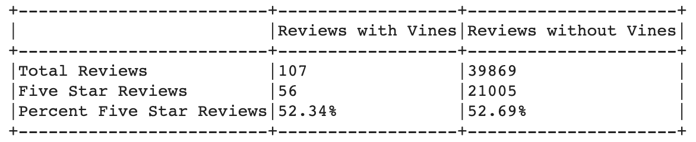

# Amazon_Vine_Analysis
Analyzing Amazon product reviews from AWS using PySpark and SQL

## Overvew
Amazon is the world's largest online marketplace offering everything from groceries, to autoparts, to recreational equipment [1]. Because there are so many options on the website, customer's often refer to the product reviews to help them compare items. 

Amazon Vine is a program that "invites the most trusted reviewers on Amazon to post opinions about new and pre-release items to help their fellow customers make informed purchase decisions" [2]. Customers with high reviewer ranks are recruited to join the Vine program, and are offered free products from participating vendors in return (Amazon notes that vendors cannot influence or edit these reviews). Knowning that customers rely heavily on the reviews section to make purchasing decisions, the Vine program's aim is to boost product sales through helpful reviews. 

For this project, we are analyzing reviews for Amazon outdoor products to determine the biase of Vine reviews. The review data was imported from AWS into GoogleColab, where the data was cleaned and exported to pgAdmin for storage. Review analysis was conducted in Google Colab.

## Results

* **Total Number of Reviews*: There were a total of 107 reviews with Vines, and 39,869 reviews without Vines for outdoor products.

* **Five Star Reviews*: A total of 56 reviews with Vines, and 21,005 reviews without Vines gave the product a five-star review.

* **Percentage of Five Star Reviews*: 52.34% of reviews with Vines gave the product a five-star review and 52.69% of reivews without Vines gave the product a five-star review.

## Summary
#### *Five Star Review Comparison*
Are Vine reviewers more likely to give a five-star review because of the free promotional products they recieve? 

From our analysis, the answer is no. Both reviews with Vines and reviews without Vines gave about 52% five-star ratings. 

From the review data, we can see that, compared to non-Vine reviews, most of the Vine reviews are not verified purchases. This indicates that these reviewers either reiceved the product for free, or they did not purchase or recieve the product, but are providing feedback anyways. 

Using Pandas and Pyspark to analyze the data, we find that less than 2% of Vine reviews are verified purchases, while over 70% of non-Vine reviews are verified.

Assuming that the 98% of Vine reviewers without verified purchases recieved the item for free as compensation for their feedback, we can say that this did not signficantly impact their likelihood to provide a five-star review compared to non-Vine reviewers.

#### *Average Review Rating Comparison*
To expand our analysis from five-star ratings, we found the average star rating for Vine and non-Vine reviews:

While Vine reviewers were not more likely to give a five-star review, they are more likely to give a higher rated review than non-Vine reviewers.

## References
1. “Amazon (Company).” Wikipedia, Wikimedia Foundation, 17 Mar. 2021, en.wikipedia.org/wiki/Amazon_(company). 

2. “What Is Amazon Vine?” Amazon, Goettsche Partners, 2011, www.amazon.com/gp/vine/help. 
